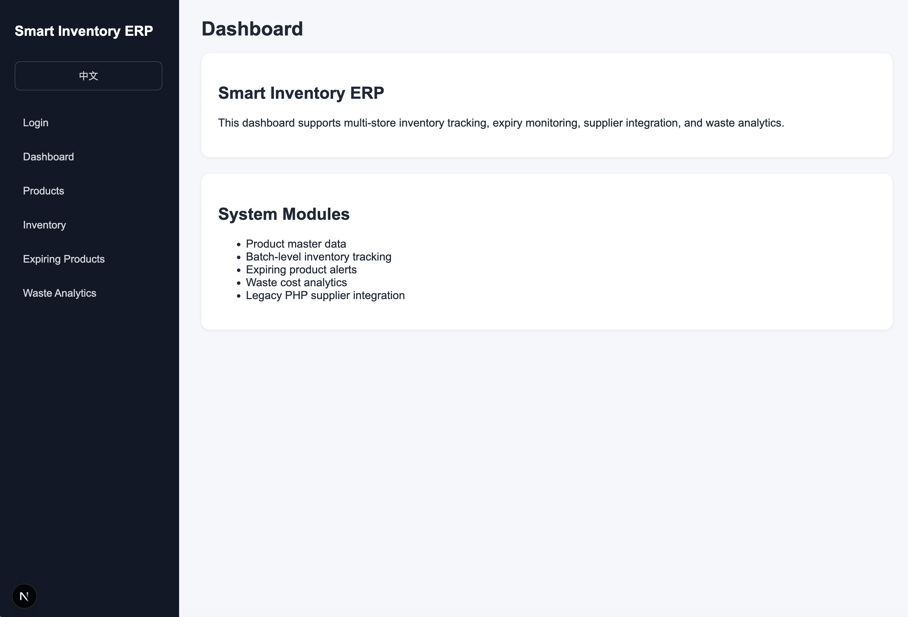
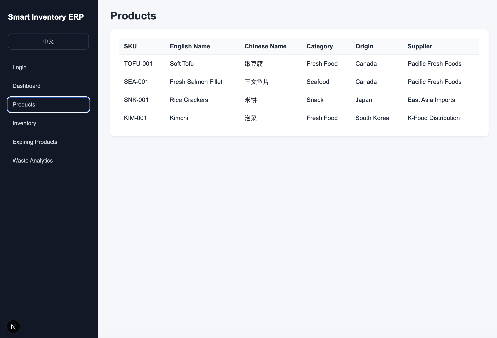
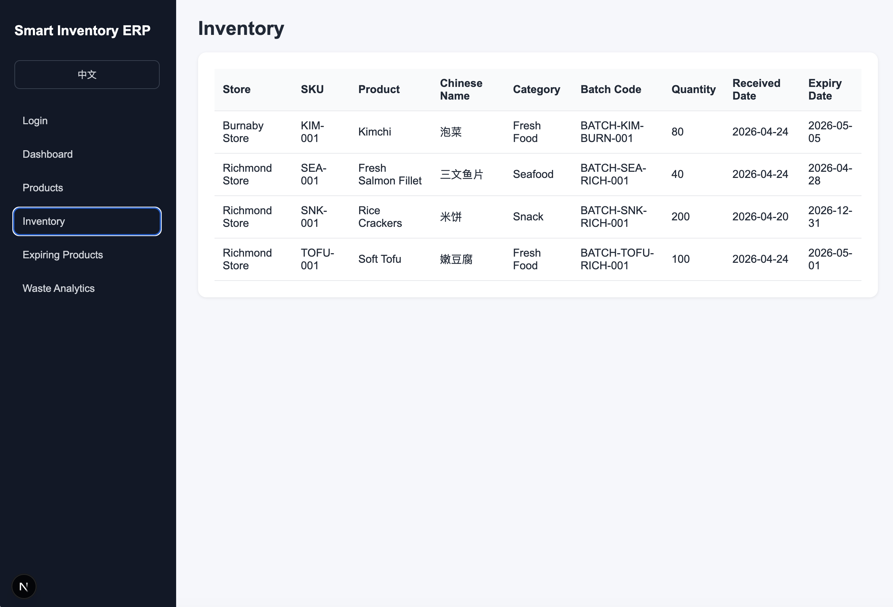
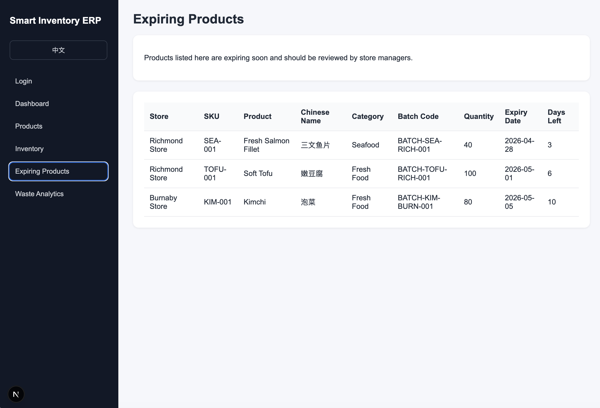
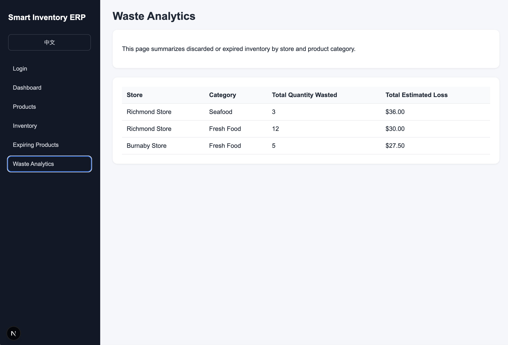
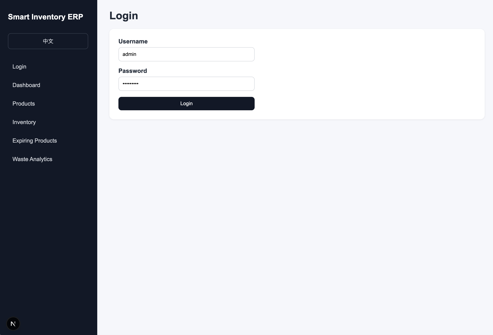

# Smart Inventory ERP System

A full-stack ERP-style inventory management system for multi-store retail operations.

This project simulates an internal business application for a supermarket or grocery retail company. It focuses on inventory tracking, expiry monitoring, waste reduction, supplier integration, authentication, and role-based access control.

---

## Business Problem

Retail grocery companies manage many expiry-sensitive products across multiple store locations. Poor inventory visibility can lead to:

- Overstock
- Out-of-stock items
- Expired products
- Food waste
- Inventory mismatch between systems

This system helps monitor inventory, detect expiring products, analyze waste, and integrate modern applications with legacy systems.

---

## Tech Stack

### Frontend

- React
- TypeScript
- Next.js

### Backend

- Node.js
- Express.js
- TypeScript

### Database

- MySQL

### Legacy System Simulation

- PHP

### Security

- JWT authentication
- bcrypt password hashing
- Role-based access control

### DevOps

- Git
- GitHub
- GitHub Actions CI
- Docker
- Docker Compose
- Kubernetes
- NGINX Ingress
- Azure deployment planning

### Analytics and Data Platform

- Python and PySpark
- Apache Airflow DAG orchestration
- Snowflake raw, staging, curated, and mart layers
- ThoughtSpot Modeling Language (TML)
- Data-quality validation and invalid-row quarantine
- Pipeline health, freshness, reconciliation, and alert history
- Cron-based Airflow watchdog and controlled recovery trigger

---

## Main Features

- Product master data
- Multi-store inventory tracking
- Batch-level expiry tracking
- Expiring product alerts
- Waste analytics
- Legacy PHP supplier service integration
- Login system
- JWT authentication
- Admin and Store Manager roles
- Bilingual UI with English and Chinese labels
- Docker Compose local deployment
- Local Kubernetes deployment
- Azure Kubernetes Service deployment planning
- Retail-media advertisers, campaigns, audiences, budgets, events, and conversions
- Campaign-to-product and campaign-to-inventory risk analysis
- Synthetic campaign-event generation at multi-million-row scale
- PySpark transformations with explicit schemas, deduplication, quarantine, and partitioned Parquet output
- Snowflake dimensional warehouse and idempotent MERGE-based reporting layers
- Airflow retries, timeouts, backfills, freshness checks, reconciliation, and failure callbacks
- Persistent technical and business alerts
- Version-controlled ThoughtSpot TML semantic models and Liveboard metadata
- Cron watchdog that checks Airflow health without becoming a competing scheduler

---

## Screenshots

### Dashboard



### Products



### Inventory



### Expiring Products



### Waste Analytics



### Login



---

## Demo Accounts

| Username | Password | Role |
|---|---|---|
| admin | abc123456 | ADMIN |
| richmond_manager | abc123456 | STORE_MANAGER |
| burnaby_manager | abc123456 | STORE_MANAGER |

---

## Quick Demo Guide

Follow these steps to test the system locally.

### Option 1: Run with Docker Compose

The recommended way to run the full system locally is Docker Compose.

From the project root, run:

    docker compose up --build

Then open:

    http://localhost:3000

Backend test URLs:

    http://localhost:5001/api/health

    http://localhost:5001/api/db-test

    http://localhost:5001/api/products

Login with:

| Username | Password |
|---|---|
| admin | abc123456 |
| richmond_manager | abc123456 |
| burnaby_manager | abc123456 |

To stop the application:

    docker compose down

To reset the Docker MySQL database:

    docker compose down -v
    docker compose up --build

Warning: `docker compose down -v` deletes only the Docker Compose MySQL volume. It does not delete a separate local Homebrew MySQL database.

---

# Option 2 — Run with Local Kubernetes

Use this option when you want to test the Kubernetes deployment.

This project includes Kubernetes manifests under:

    k8s/base

The local Kubernetes setup runs:

| Component | Kubernetes Resource |
|---|---|
| Frontend | Deployment + Service |
| Backend | Deployment + Service |
| MySQL | Deployment + Service + PersistentVolumeClaim |
| Legacy PHP service | Deployment + Service |
| Configuration | ConfigMap |
| Demo secrets | Secret |
| External access | Ingress |

The local Kubernetes app is accessed through:

    http://smart-inventory.local

---

## 1. Make sure Docker Desktop Kubernetes is enabled

Open Docker Desktop.

Go to:

    Settings → Kubernetes → Enable Kubernetes → Apply & Restart

Wait until Docker Desktop finishes restarting.

Then verify Kubernetes is running:

    kubectl get nodes

Good result should show a node with:

    Ready

Example:

    desktop-control-plane   Ready   control-plane

If you see a connection error such as:

    The connection to the server localhost:8080 was refused

then Kubernetes is not running yet, or `kubectl` is not connected to the correct local cluster.

---

## 2. Confirm the current Kubernetes context

Run:

    kubectl config current-context

For Docker Desktop Kubernetes, the context is usually:

    docker-desktop

If needed, switch to Docker Desktop Kubernetes:

    kubectl config use-context docker-desktop

Then test again:

    kubectl get nodes

---

## 3. Build local Docker images for Kubernetes

Kubernetes needs container images before it can start the application pods.

From the project root, build the backend image:

    docker build -t smart-inventory-backend:latest ./backend

Build the legacy PHP image:

    docker build -t smart-inventory-legacy-php:latest ./legacy-php

Build the frontend image:

    docker build \
      --build-arg NEXT_PUBLIC_API_BASE_URL=http://smart-inventory.local \
      --build-arg SERVER_API_BASE_URL=http://backend:5001 \
      -t smart-inventory-frontend:latest \
      ./frontend

The frontend build arguments are important.

| Variable | Purpose |
|---|---|
| `NEXT_PUBLIC_API_BASE_URL` | Browser-side API URL used by client-side code such as login |
| `SERVER_API_BASE_URL` | Internal Kubernetes backend URL used by server-rendered Next.js pages |

For local Kubernetes, browser-side requests should go through:

    http://smart-inventory.local

Server-side frontend requests can use the internal Kubernetes backend service:

    http://backend:5001

---

## 4. Install NGINX Ingress Controller

The project uses Kubernetes Ingress so the browser can access the app through one local domain.

Install the NGINX Ingress Controller:

    kubectl apply -f https://raw.githubusercontent.com/kubernetes/ingress-nginx/controller-v1.12.1/deploy/static/provider/cloud/deploy.yaml

Check the ingress controller pods:

    kubectl get pods -n ingress-nginx

Wait until the controller pod shows:

    Running

Also check the ingress controller service:

    kubectl get svc -n ingress-nginx

---

## 5. Configure the local domain

The project uses this local domain:

    smart-inventory.local

Edit your hosts file:

    sudo nano /etc/hosts

Add this line:

    127.0.0.1 smart-inventory.local

Save and exit.

Test the local domain:

    ping smart-inventory.local

Good result should show it resolving to:

    127.0.0.1

Stop the ping with:

    Control + C

If the browser does not work later, check the Ingress address:

    kubectl get ingress -n smart-inventory

If Kubernetes shows a specific address such as:

    172.19.0.5

then update `/etc/hosts` to:

    172.19.0.5 smart-inventory.local

---

## 6. Apply the Kubernetes namespace

Apply the namespace first:

    kubectl apply -f k8s/base/namespace.yaml

Verify:

    kubectl get namespaces

You should see:

    smart-inventory

---

## 7. Apply configuration and secrets

Apply the ConfigMap:

    kubectl apply -f k8s/base/configmap.yaml

Apply the Secret:

    kubectl apply -f k8s/base/secret.yaml

Apply the MySQL initialization ConfigMap:

    kubectl apply -f k8s/base/mysql-init-configmap.yaml

These files provide the environment variables, demo credentials, schema SQL, and seed SQL needed by the local Kubernetes deployment.

---

## 8. Start MySQL in Kubernetes

Apply the MySQL manifest:

    kubectl apply -f k8s/base/mysql.yaml

Check the MySQL pod:

    kubectl get pods -n smart-inventory

Wait until MySQL becomes:

    1/1 Running

You can also check MySQL logs:

    kubectl logs deployment/mysql -n smart-inventory

The MySQL pod loads:

    database/schema.sql
    database/seed.sql

through:

    k8s/base/mysql-init-configmap.yaml

Important: MySQL initialization only runs when the Kubernetes MySQL data volume is empty. If you need to reload schema and seed data, reset the namespace:

    kubectl delete namespace smart-inventory

Then reapply the manifests from the namespace step.

---

## 9. Start the legacy PHP service

Apply the PHP manifest:

    kubectl apply -f k8s/base/legacy-php.yaml

Check:

    kubectl get pods -n smart-inventory

Good result:

    legacy-php   1/1 Running

---

## 10. Start the backend

Apply the backend manifest:

    kubectl apply -f k8s/base/backend.yaml

Check:

    kubectl get pods -n smart-inventory

Good result:

    backend   1/1 Running

Check backend logs if needed:

    kubectl logs deployment/backend -n smart-inventory

The backend connects to:

| Dependency | Kubernetes URL |
|---|---|
| MySQL | `mysql:3306` |
| Legacy PHP | `http://legacy-php:8000` |

---

## 11. Start the frontend

Apply the frontend manifest:

    kubectl apply -f k8s/base/frontend.yaml

Check:

    kubectl get pods -n smart-inventory

Good result:

    frontend   1/1 Running

Check frontend logs if needed:

    kubectl logs deployment/frontend -n smart-inventory

---

## 12. Apply the Ingress

Apply the Ingress manifest:

    kubectl apply -f k8s/base/ingress.yaml

Check:

    kubectl get ingress -n smart-inventory

Expected host:

    smart-inventory.local

The Ingress routes:

| Path | Service |
|---|---|
| `/` | frontend |
| `/api` | backend |

Important: the Ingress should not rewrite `/api` paths. The backend routes already include the `/api` prefix.

For example:

| Browser URL | Backend should receive |
|---|---|
| `/api/health` | `/api/health` |
| `/api/db-test` | `/api/db-test` |
| `/api/products` | `/api/products` |

---

## 13. Verify all Kubernetes resources

Check pods:

    kubectl get pods -n smart-inventory

Good result:

    mysql        1/1 Running
    backend      1/1 Running
    frontend     1/1 Running
    legacy-php   1/1 Running

Check services:

    kubectl get svc -n smart-inventory

Expected services:

    mysql
    backend
    frontend
    legacy-php

Check Ingress:

    kubectl get ingress -n smart-inventory

Expected host:

    smart-inventory.local

---

## 14. Test the application

Open the frontend:

    http://smart-inventory.local

Test backend through Ingress:

    http://smart-inventory.local/api/health

    http://smart-inventory.local/api/db-test

    http://smart-inventory.local/api/products

    http://smart-inventory.local/api/inventory

    http://smart-inventory.local/api/expiring-products

    http://smart-inventory.local/api/analytics/waste-summary

    http://smart-inventory.local/api/legacy-suppliers

Login with:

| Username | Password | Role |
|---|---|---|
| `admin` | `abc123456` | ADMIN |
| `richmond_manager` | `abc123456` | STORE_MANAGER |
| `burnaby_manager` | `abc123456` | STORE_MANAGER |

After login, verify:

- Products page
- Inventory page
- Expiring Products page
- Waste Analytics page
- Legacy supplier integration
- Chinese product names display correctly

---

## 15. Useful Kubernetes debugging commands

Check pods:

    kubectl get pods -n smart-inventory

Check services:

    kubectl get svc -n smart-inventory

Check ingress:

    kubectl get ingress -n smart-inventory

Check backend logs:

    kubectl logs deployment/backend -n smart-inventory

Check frontend logs:

    kubectl logs deployment/frontend -n smart-inventory

Check MySQL logs:

    kubectl logs deployment/mysql -n smart-inventory

Check legacy PHP logs:

    kubectl logs deployment/legacy-php -n smart-inventory

Describe a pod:

    kubectl describe pod <pod-name> -n smart-inventory

Restart backend:

    kubectl rollout restart deployment/backend -n smart-inventory

Restart frontend:

    kubectl rollout restart deployment/frontend -n smart-inventory

Restart legacy PHP:

    kubectl rollout restart deployment/legacy-php -n smart-inventory

---

## 16. Common Kubernetes issues

### Issue: ImagePullBackOff

Check pods:

    kubectl get pods -n smart-inventory

If a pod shows:

    ImagePullBackOff

then Kubernetes cannot find the local image.

Rebuild the images:

    docker build -t smart-inventory-backend:latest ./backend
    docker build -t smart-inventory-legacy-php:latest ./legacy-php
    docker build \
      --build-arg NEXT_PUBLIC_API_BASE_URL=http://smart-inventory.local \
      --build-arg SERVER_API_BASE_URL=http://backend:5001 \
      -t smart-inventory-frontend:latest \
      ./frontend

Then restart the affected deployment:

    kubectl rollout restart deployment/backend -n smart-inventory
    kubectl rollout restart deployment/frontend -n smart-inventory
    kubectl rollout restart deployment/legacy-php -n smart-inventory

### Issue: Cannot GET /health or Cannot GET /db-test

This usually means the Ingress is rewriting `/api/health` into `/health`.

The Ingress should preserve `/api`.

Correct behavior:

    /api/health -> /api/health
    /api/db-test -> /api/db-test

Check:

    k8s/base/ingress.yaml

The Ingress should route `/api` to the backend without removing `/api`.

### Issue: Login cannot reach backend

For local Kubernetes, the frontend image must be built with:

    NEXT_PUBLIC_API_BASE_URL=http://smart-inventory.local

Rebuild the frontend image:

    docker build \
      --build-arg NEXT_PUBLIC_API_BASE_URL=http://smart-inventory.local \
      --build-arg SERVER_API_BASE_URL=http://backend:5001 \
      -t smart-inventory-frontend:latest \
      ./frontend

Restart frontend:

    kubectl rollout restart deployment/frontend -n smart-inventory

### Issue: Chinese text is corrupted

Reset the Kubernetes MySQL database and reapply the manifests:

    kubectl delete namespace smart-inventory

Then reapply from the namespace step.

The project uses `utf8mb4` in:

- `database/schema.sql`
- `database/seed.sql`
- `backend/src/config/database.ts`
- `k8s/base/mysql.yaml`

### Issue: smart-inventory.local does not open

Check Ingress:

    kubectl get ingress -n smart-inventory

Check hosts file:

    cat /etc/hosts

Make sure it contains either:

    127.0.0.1 smart-inventory.local

or the address shown by the Ingress:

    <ingress-address> smart-inventory.local

---

## 17. Stop the local Kubernetes app

To remove the project from Kubernetes:

    kubectl delete namespace smart-inventory

This removes:

- frontend pod
- backend pod
- MySQL pod
- legacy PHP pod
- services
- ingress
- local Kubernetes MySQL data for this namespace

It does not delete your source code.

### Option 3: Run Services Manually

#### 0. Database

Database username:

    root

Database password:

    abc123456

Start MySQL:

    brew services start mysql

Load schema and seed data:

    mysql -u root -p < database/schema.sql
    mysql -u root -p < database/seed.sql

#### 1. Start backend

    cd backend
    npm install
    npm run dev

Backend runs at:

    http://localhost:5001

#### 2. Start frontend

    cd frontend
    npm install
    npm run dev

Frontend runs at:

    http://localhost:3000

#### 3. Start PHP legacy service

    cd legacy-php
    php -S localhost:8000

PHP service runs at:

    http://localhost:8000/suppliers.php

---

## Docker Compose Local Deployment

The Smart Inventory ERP system can be run locally with Docker Compose.

This starts the full application stack:

- Next.js frontend
- Node.js / Express backend
- MySQL database
- Legacy PHP supplier service

### Prerequisites

Install and start Docker Desktop.

Confirm Docker is available:

    docker --version

Confirm Docker Compose is available:

    docker compose version

### Docker Services

Docker Compose runs the following services:

| Service | Container Name | Internal Port | Local URL |
|---|---|---:|---|
| Frontend | smart-inventory-frontend | 3000 | http://localhost:3000 |
| Backend | smart-inventory-backend | 5001 | http://localhost:5001 |
| MySQL | smart-inventory-mysql | 3306 | Host port 3307 |
| Legacy PHP | smart-inventory-legacy-php | 8000 | http://localhost:8000 |

The MySQL container maps local host port `3307` to container port `3306` to avoid conflicts with a local MySQL installation that may already use port `3306`.

### Start the Full Application

From the project root, run:

    docker compose up --build

Then open:

    http://localhost:3000

### Backend Test URLs

After the containers start, verify the backend:

    http://localhost:5001/api/health

    http://localhost:5001/api/db-test

    http://localhost:5001/api/products

    http://localhost:5001/api/inventory

    http://localhost:5001/api/expiring-products

    http://localhost:5001/api/analytics/waste-summary

    http://localhost:5001/api/legacy-suppliers

### Stop the Application

To stop the containers while keeping the MySQL Docker volume:

    docker compose down

### Reset the Docker Database

If the database schema or seed data changes, reset the Docker MySQL volume:

    docker compose down -v
    docker compose up --build

Warning: `docker compose down -v` deletes the Docker Compose MySQL volume. It does not delete a separate local Homebrew MySQL database.

### Docker Networking Notes

Inside Docker Compose, containers communicate by service name.

| Connection | URL |
|---|---|
| Backend to MySQL | mysql:3306 |
| Backend to legacy PHP service | http://legacy-php:8000 |
| Frontend server-side rendering to backend | http://backend:5001 |
| Browser to backend | http://localhost:5001 |

The frontend uses two API base URLs.

| Variable | Purpose |
|---|---|
| SERVER_API_BASE_URL | Used by server-rendered Next.js pages inside the frontend container |
| NEXT_PUBLIC_API_BASE_URL | Used by browser-side client code such as login |

### Character Encoding

The Docker MySQL setup uses `utf8mb4` so Chinese product names display correctly.

Relevant files:

- database/schema.sql
- database/seed.sql
- backend/src/config/database.ts
- docker-compose.yml

---

## Local Kubernetes Deployment

The project includes Kubernetes manifests under:

    k8s/base

These manifests allow the full Smart Inventory ERP system to run in a local Kubernetes cluster.

The local Kubernetes deployment includes:

- Next.js frontend
- Node.js / Express backend
- MySQL database
- Legacy PHP supplier service
- ConfigMap for non-secret configuration
- Secret for demo credentials
- Ingress for local browser access

### Kubernetes Files

| File | Purpose |
|---|---|
| k8s/base/namespace.yaml | Creates the smart-inventory namespace |
| k8s/base/configmap.yaml | Stores non-secret application configuration |
| k8s/base/secret.yaml | Stores demo secret values for local testing |
| k8s/base/mysql.yaml | Runs MySQL for local Kubernetes testing |
| k8s/base/mysql-init-configmap.yaml | Provides schema and seed SQL files to MySQL |
| k8s/base/backend.yaml | Runs the backend Deployment and Service |
| k8s/base/frontend.yaml | Runs the frontend Deployment and Service |
| k8s/base/legacy-php.yaml | Runs the legacy PHP Deployment and Service |
| k8s/base/ingress.yaml | Exposes frontend and backend through smart-inventory.local |

### Prerequisites

Install and start Docker Desktop.

Enable Kubernetes in Docker Desktop:

    Docker Desktop → Settings → Kubernetes → Enable Kubernetes → Apply & Restart

Verify Kubernetes is running:

    kubectl get nodes

Expected result:

    STATUS should show Ready

Example:

    desktop-control-plane   Ready   control-plane

### Build Local Docker Images

Before applying Kubernetes manifests, build the local images.

Backend:

    docker build -t smart-inventory-backend:latest ./backend

Legacy PHP:

    docker build -t smart-inventory-legacy-php:latest ./legacy-php

Frontend:

    docker build \
      --build-arg NEXT_PUBLIC_API_BASE_URL=http://smart-inventory.local \
      --build-arg SERVER_API_BASE_URL=http://backend:5001 \
      -t smart-inventory-frontend:latest \
      ./frontend

The frontend build arguments are important.

| Variable | Purpose |
|---|---|
| NEXT_PUBLIC_API_BASE_URL | Browser-side API URL used by client-side code such as login |
| SERVER_API_BASE_URL | Internal Kubernetes backend URL used by server-rendered Next.js pages |

### Local Domain Setup

The local Kubernetes deployment uses:

    http://smart-inventory.local

Add this line to `/etc/hosts`:

    127.0.0.1 smart-inventory.local

If the Ingress shows a different local address, use the address shown by:

    kubectl get ingress -n smart-inventory

Example:

    172.19.0.5 smart-inventory.local

### Install NGINX Ingress Controller

Apply the NGINX Ingress Controller:

    kubectl apply -f https://raw.githubusercontent.com/kubernetes/ingress-nginx/controller-v1.12.1/deploy/static/provider/cloud/deploy.yaml

Check that the ingress controller is running:

    kubectl get pods -n ingress-nginx

Wait until the controller pod shows:

    Running

### Apply Kubernetes Manifests

Apply the namespace first:

    kubectl apply -f k8s/base/namespace.yaml

Then apply the application resources:

    kubectl apply -f k8s/base/configmap.yaml
    kubectl apply -f k8s/base/secret.yaml
    kubectl apply -f k8s/base/mysql-init-configmap.yaml
    kubectl apply -f k8s/base/mysql.yaml
    kubectl apply -f k8s/base/legacy-php.yaml
    kubectl apply -f k8s/base/backend.yaml
    kubectl apply -f k8s/base/frontend.yaml
    kubectl apply -f k8s/base/ingress.yaml

### Verify Kubernetes Resources

Check pods:

    kubectl get pods -n smart-inventory

Expected result:

    mysql        1/1 Running
    backend      1/1 Running
    frontend     1/1 Running
    legacy-php   1/1 Running

Check services:

    kubectl get svc -n smart-inventory

Expected services:

    mysql
    backend
    frontend
    legacy-php

Check ingress:

    kubectl get ingress -n smart-inventory

Expected host:

    smart-inventory.local

### Test the Application

Open the frontend:

    http://smart-inventory.local

Test backend through Ingress:

    http://smart-inventory.local/api/health

    http://smart-inventory.local/api/db-test

    http://smart-inventory.local/api/products

Login with:

| Username | Password | Role |
|---|---|---|
| admin | abc123456 | ADMIN |
| richmond_manager | abc123456 | STORE_MANAGER |
| burnaby_manager | abc123456 | STORE_MANAGER |

After login, verify:

- Products page
- Inventory page
- Expiring Products page
- Waste Analytics page
- Legacy supplier integration
- Chinese product names display correctly

### Useful Kubernetes Debugging Commands

Check pods:

    kubectl get pods -n smart-inventory

Check backend logs:

    kubectl logs deployment/backend -n smart-inventory

Check frontend logs:

    kubectl logs deployment/frontend -n smart-inventory

Check MySQL logs:

    kubectl logs deployment/mysql -n smart-inventory

Check legacy PHP logs:

    kubectl logs deployment/legacy-php -n smart-inventory

Describe a pod:

    kubectl describe pod <pod-name> -n smart-inventory

Restart backend:

    kubectl rollout restart deployment/backend -n smart-inventory

Restart frontend:

    kubectl rollout restart deployment/frontend -n smart-inventory

### Reset Local Kubernetes Deployment

Delete the namespace:

    kubectl delete namespace smart-inventory

Reapply from the namespace step:

    kubectl apply -f k8s/base/namespace.yaml

Then reapply the remaining manifests.

Warning: deleting the namespace removes the local Kubernetes MySQL data volume for this project.

### Local Kubernetes Networking Notes

Inside Kubernetes, services communicate by service name.

| Connection | URL |
|---|---|
| Backend to MySQL | mysql:3306 |
| Backend to legacy PHP service | http://legacy-php:8000 |
| Frontend server-side rendering to backend | http://backend:5001 |
| Browser to app through Ingress | http://smart-inventory.local |

The Ingress routes:

| Path | Service |
|---|---|
| / | frontend |
| /api | backend |

The Ingress must not rewrite `/api` paths, because the backend routes are defined with the `/api` prefix.

---

## Future Azure Kubernetes Service Deployment

The Kubernetes manifests are designed so they can later be adapted for Azure Kubernetes Service.

The future Azure deployment target may use:

- Azure Container Registry for Docker images
- Azure Kubernetes Service for application workloads
- Azure Database for MySQL for production database storage
- Kubernetes Secrets or Azure Key Vault for secret management
- Production Ingress with HTTPS and a real DNS name

### Local Images vs Azure Images

Local Kubernetes uses local image names:

- smart-inventory-backend:latest
- smart-inventory-frontend:latest
- smart-inventory-legacy-php:latest

Future AKS deployment should use Azure Container Registry image names, for example:

- smartinventoryacr.azurecr.io/smart-inventory-backend:latest
- smartinventoryacr.azurecr.io/smart-inventory-frontend:latest
- smartinventoryacr.azurecr.io/smart-inventory-legacy-php:latest

### Azure Database for MySQL

Local Kubernetes uses a MySQL pod for testing.

For production on Azure, the preferred approach is Azure Database for MySQL.

In that case, do not deploy:

    k8s/base/mysql.yaml
    k8s/base/mysql-init-configmap.yaml

Instead, update the backend environment variables:

    DB_HOST=<azure-mysql-server-name>.mysql.database.azure.com
    DB_PORT=3306
    DB_NAME=smart_inventory_erp
    DB_USER=<azure-mysql-username>

The database password should be stored securely in Kubernetes Secret, Azure Key Vault, or a secure CI/CD secret system.

### Production Ingress

Local Kubernetes uses:

    smart-inventory.local

Production should use a real domain, for example:

    smart-inventory.example.com

Production should also enable HTTPS.

Possible options include:

- NGINX Ingress Controller with TLS
- Azure Application Gateway Ingress Controller
- Azure Front Door
- cert-manager for certificate automation

### Azure Documentation

More details are documented in:

- docs/azure-container-registry-plan.md
- docs/azure-kubernetes-service-deployment-notes.md
- docs/azure-mysql-migration-notes.md

---

## System Components

| Component | Purpose |
|---|---|
| frontend | Next.js dashboard UI |
| backend | Node.js REST API |
| database | MySQL schema and seed data |
| legacy-php | Simulated legacy supplier service |
| docs | Documentation and system design |
| k8s | Kubernetes deployment manifests |
| .github/workflows | GitHub Actions CI workflows |

---

## Key API Endpoints

| Endpoint | Purpose |
|---|---|
| GET /api/products | Get product master data |
| GET /api/inventory | Get inventory batches |
| GET /api/expiring-products | Get products expiring soon |
| GET /api/analytics/waste-summary | Get waste analytics |
| POST /api/auth/login | User login |
| GET /api/legacy-suppliers | Node.js calls PHP supplier service |
| GET /api/health | Backend health check |
| GET /api/db-test | Backend database connection test |

---

## Authentication and Role-Based Access

The system supports JWT-based authentication.

Demo users:

| Username | Password | Role |
|---|---|---|
| admin | abc123456 | ADMIN |
| richmond_manager | abc123456 | STORE_MANAGER |
| burnaby_manager | abc123456 | STORE_MANAGER |

Admin users have broader access. Store Manager users have limited access based on role rules.

Example admin route test:

    GET http://localhost:5001/api/admin-test

Expected behavior:

| User | Result |
|---|---|
| admin | Success |
| store manager | Forbidden |

---

## Legacy PHP Integration

The project includes a simulated legacy PHP supplier service.

When running manually, the PHP service runs at:

    http://localhost:8000/suppliers.php

When running inside Docker Compose or Kubernetes, the backend calls the PHP service by internal service name:

    http://legacy-php:8000

Backend integration endpoint:

    http://localhost:5001/api/legacy-suppliers

or through local Kubernetes ingress:

    http://smart-inventory.local/api/legacy-suppliers

---

## Local Development

### 1. Start MySQL

    brew services start mysql

Load schema and seed data:

    mysql -u root -p < database/schema.sql
    mysql -u root -p < database/seed.sql

### 2. Start backend

    cd backend
    npm install
    npm run dev

Backend runs at:

    http://localhost:5001

### 3. Start frontend

    cd frontend
    npm install
    npm run dev

Frontend runs at:

    http://localhost:3000

### 4. Start PHP legacy service

    cd legacy-php
    php -S localhost:8000

PHP service runs at:

    http://localhost:8000/suppliers.php

---

## CI/CD

GitHub Actions automatically checks:

- Backend build
- Frontend build
- Frontend lint
- PHP syntax
- Documentation files
- Docker image builds
- Docker Compose configuration

Docker build checks verify:

- Backend Docker image builds successfully
- Frontend Docker image builds successfully
- Legacy PHP Docker image builds successfully
- Docker Compose configuration is valid

---

## Azure Deployment Planning

This project includes planning documentation for future Azure deployment.

Relevant documents:

- docs/azure-container-registry-plan.md
- docs/azure-kubernetes-service-deployment-notes.md
- docs/azure-mysql-migration-notes.md

The future Azure target architecture may use:

- Azure Container Registry for Docker images
- Azure Kubernetes Service for application workloads
- Azure Database for MySQL for production database storage
- Kubernetes Secrets or Azure Key Vault for secret management
- Production Ingress with HTTPS and a real DNS name

The current verified deployment targets are:

- Local manual development
- Docker Compose local deployment
- Local Kubernetes deployment

---

## Analytics and Retail-Media Extension

The `analytics/` directory adds an isolated data-engineering and reporting layer to the existing ERP application. It does not replace or rewrite the Next.js frontend, Express backend, MySQL operational database, legacy PHP service, Docker Compose stack, or Kubernetes deployment.

The extension connects retail-media campaign performance with product and inventory availability. This supports questions such as:

- Is a high-performing campaign promoting a product that is low in stock?
- Which campaigns are overspending or underspending against plan?
- Which stores, products, audiences, and channels are producing the strongest results?
- Are campaign and inventory datasets complete, fresh, and internally consistent?
- Which technical or business exceptions require immediate action?

### Analytics architecture

```text
MySQL operational ERP and retail-media tables
        ↓
Airflow orchestration
        ↓
Python extraction and synthetic event ingestion
        ↓
PySpark validation, quarantine, transformation, and Parquet output
        ↓
Snowflake RAW → STAGING → CURATED → MARTS
        ↓
ThoughtSpot TML models and executive reporting
        ↓
Technical alerts, business alerts, and cron watchdog
```

Detailed design documents:

- `docs/analytics-architecture.md`
- `docs/data-lineage.md`
- `docs/kpi-dictionary.md`
- `docs/pipeline-runbook.md`
- `docs/cron-watchdog.md`

### Retail-media operational module

The MySQL operational model adds:

- `advertisers`
- `campaigns`
- `campaign_products`
- `audience_segments`
- `campaign_daily_events`
- `campaign_budgets`
- `campaign_conversions`
- `analytics_alerts`

The backend exposes authenticated retail-media routes for campaign operations and reporting while preserving the existing inventory, waste, authentication, audit, and supplier APIs.

### Analytics directory structure

```text
analytics/
├── airflow/
│   ├── dags/
│   └── tests/
├── config/
├── data/
│   ├── generated/
│   ├── raw/
│   ├── curated/
│   ├── quarantine/
│   └── quality/
├── data_generator/
├── monitoring/
├── pyspark/
│   ├── jobs/
│   └── tests/
├── snowflake/
│   ├── ddl/
│   ├── raw/
│   ├── staging/
│   ├── curated/
│   ├── marts/
│   └── tests/
└── thoughtspot/
    └── tml/
```

### Environment configuration

Copy the analytics environment template and enter the required credentials:

```bash
cp .env.analytics.example .env.analytics
```

Important variables include:

- `SMART_INVENTORY_ENV`
- `ANALYTICS_CONFIG`
- `MYSQL_HOST`, `MYSQL_PORT`, `MYSQL_DATABASE`, `MYSQL_USER`, `MYSQL_PASSWORD`
- `SNOWFLAKE_ACCOUNT`, `SNOWFLAKE_USER`, `SNOWFLAKE_PASSWORD`
- `SNOWFLAKE_WAREHOUSE`, `SNOWFLAKE_DATABASE`, `SNOWFLAKE_ROLE`
- `ALERT_WEBHOOK_URL`
- `THOUGHTSPOT_HOST`, `THOUGHTSPOT_BEARER_TOKEN`, `THOUGHTSPOT_CONNECTION_GUID`
- `AIRFLOW_BASE_URL`, `AIRFLOW_USERNAME`, `AIRFLOW_PASSWORD`, `AIRFLOW_DAG_ID`
- `AIRFLOW_EXPECTED_RUN_HOURS`, `AIRFLOW_BACKUP_TRIGGER_ENABLED`, `CRON_INTERVAL`

Do not commit `.env.analytics` or production credentials.

### Start the ERP and analytics environments

Start the existing application stack first:

```bash
docker compose up -d --build
```

Start the separate analytics services:

```bash
docker compose \
  -f docker-compose.analytics.yml \
  --env-file .env.analytics \
  up -d --build
```

Open Airflow at:

```text
http://localhost:8080
```

The local Airflow deployment uses standalone mode for development. A production deployment should use a supported external metadata database, production executor, remote logging, secret management, and managed infrastructure.

### Generate realistic campaign data

The generator creates products, stores, advertisers, audiences, campaigns, budgets, conversions, and multi-million-row daily event data. It can deliberately inject duplicate events, missing campaign IDs, invalid metric relationships, negative spend, invalid dates, late-arriving records, and promoted-product inventory risk.

Generate the default three million event rows:

```bash
docker compose \
  -f docker-compose.analytics.yml \
  --env-file .env.analytics \
  exec analytics-runner \
  python analytics/data_generator/generate_retail_media_data.py \
  --rows 3000000
```

Run a smaller local smoke test:

```bash
docker compose \
  -f docker-compose.analytics.yml \
  --env-file .env.analytics \
  exec analytics-runner \
  python analytics/data_generator/generate_retail_media_data.py \
  --rows 5000 \
  --chunk-size 1000
```

### Run the PySpark pipeline manually

The PySpark jobs use explicit schemas and produce cleaned, quarantined, quality, and curated Parquet datasets partitioned by business date.

```bash
docker compose \
  -f docker-compose.analytics.yml \
  --env-file .env.analytics \
  exec analytics-runner \
  python -m analytics.pyspark.jobs.run_all \
  --business-date 2026-07-30
```

The pipeline produces:

- `campaign_daily_performance`
- `inventory_daily_snapshot`
- `waste_daily_summary`
- `promoted_product_inventory_risk`
- `pipeline_data_quality_results`

Invalid campaign records are written to the quarantine area instead of being silently discarded.

### Snowflake warehouse

The Snowflake implementation creates:

- `RAW` source tables
- `STAGING` normalized tables
- `CURATED` dimensions and facts
- `MARTS` decision-oriented reporting models
- reconciliation and freshness checks

Apply the SQL layers manually when required:

```bash
docker compose -f docker-compose.analytics.yml --env-file .env.analytics exec analytics-runner \
  python -m analytics.snowflake.run_sql ddl
docker compose -f docker-compose.analytics.yml --env-file .env.analytics exec analytics-runner \
  python -m analytics.snowflake.run_sql raw
docker compose -f docker-compose.analytics.yml --env-file .env.analytics exec analytics-runner \
  python -m analytics.snowflake.run_sql staging
docker compose -f docker-compose.analytics.yml --env-file .env.analytics exec analytics-runner \
  python -m analytics.snowflake.run_sql curated
docker compose -f docker-compose.analytics.yml --env-file .env.analytics exec analytics-runner \
  python -m analytics.snowflake.run_sql marts
```

Load Parquet data for a business date:

```bash
docker compose \
  -f docker-compose.analytics.yml \
  --env-file .env.analytics \
  exec analytics-runner \
  python -m analytics.snowflake.load_parquet \
  --business-date 2026-07-30
```

Snowflake transformations use business keys and `MERGE` logic so a business date can be rerun without creating duplicate curated records.

### Airflow daily pipeline

The DAG is defined at:

```text
analytics/airflow/dags/smart_inventory_daily_analytics.py
```

DAG ID:

```text
smart_inventory_daily_analytics
```

Normal schedule:

```text
0 4 * * * UTC
```

The task chain is:

```text
check_mysql
    ↓
extract_operational_tables
    ↓
generate_or_ingest_campaign_events
    ↓
run_pyspark_transformations
    ↓
run_preload_quality_checks
    ↓
load_snowflake_raw
    ↓
build_staging_tables
    ↓
build_dimensions
    ↓
build_facts
    ↓
build_marts
    ↓
run_reconciliation_checks
    ↓
validate_data_freshness
    ↓
publish_pipeline_status
    ↓
send_success_or_failure_alert
```

The DAG supports retries, retry delays, execution timeouts, failure callbacks, idempotent business-date processing, catch-up runs, date-based backfills, freshness checks, and reconciliation.

Trigger a manual run from the Airflow UI, or use the shared API helper from a shell:

```bash
set -a
source .env.analytics
set +a
source scripts/airflow-api.sh

run_id="manual__readme__$(date -u +%Y%m%dT%H%M%SZ)"
logical_date="$(date -u +%Y-%m-%dT%H:%M:%SZ)"
payload="$(jq -n \
  --arg run_id "$run_id" \
  --arg logical_date "$logical_date" \
  '{dag_run_id:$run_id,logical_date:$logical_date,conf:{triggered_by:"readme"}}')"

airflow_api POST \
  "/api/v2/dags/smart_inventory_daily_analytics/dagRuns" \
  "$payload"
```

### Alerting and monitoring

Technical alerts include:

- Airflow task failure
- Missing daily partition
- Stale Snowflake data
- Unexpected row-count changes
- PySpark processing failure
- Snowflake load failure
- TML deployment failure

Business alerts include:

- Campaign pacing above or below threshold
- Low ROAS
- High CPA
- Promoted SKU with low stock
- Promoted SKU approaching expiry
- Sudden waste-rate increase

Alerts are persisted in `analytics_alerts` with a stable alert key so duplicate active alerts are suppressed and recovery can be tracked.

### ThoughtSpot TML

Version-controlled TML assets are stored in:

```text
analytics/thoughtspot/tml/
```

Included metadata:

- `inventory_model.table.tml`
- `campaign_performance.model.tml`
- `campaign_pacing.model.tml`
- `promoted_product_risk.model.tml`
- `pipeline_health.model.tml`
- `executive_overview.liveboard.tml`

Validate all TML locally:

```bash
docker compose \
  -f docker-compose.analytics.yml \
  --env-file .env.analytics \
  exec analytics-runner \
  python -m analytics.thoughtspot.validate_tml
```

Validate against ThoughtSpot without importing:

```bash
docker compose \
  -f docker-compose.analytics.yml \
  --env-file .env.analytics \
  exec analytics-runner \
  python -m analytics.thoughtspot.deploy_tml \
  --validate-only
```

Deploy after mart schemas are stable:

```bash
docker compose \
  -f docker-compose.analytics.yml \
  --env-file .env.analytics \
  exec analytics-runner \
  python -m analytics.thoughtspot.deploy_tml
```

Governed measures include CPM, CTR, CPC, CPA, ROAS, budget utilization, pacing variance, inventory turnover, waste rate, expiring inventory value, and stock availability.

### Cron watchdog

Airflow remains the only normal scheduler. Cron checks Airflow health and verifies that the expected DAG run exists. It does not independently launch the daily pipeline on every interval.

Install the watchdog:

```bash
./scripts/install-cron-watchdog.sh
```

Run a health check manually:

```bash
./scripts/check-airflow-health.sh
```

Trigger one controlled recovery request only when the expected run is missing:

```bash
./scripts/trigger-airflow-backup.sh
```

The scripts use a lock and recheck active and recent runs before triggering recovery, which reduces the risk of duplicate execution.

### Validation and tests

Run analytics Python tests:

```bash
docker compose \
  -f docker-compose.analytics.yml \
  --env-file .env.analytics \
  exec analytics-runner \
  pytest analytics/data_generator analytics/pyspark/tests analytics/airflow/tests
```

Validate TML:

```bash
docker compose \
  -f docker-compose.analytics.yml \
  --env-file .env.analytics \
  exec analytics-runner \
  pytest analytics/thoughtspot/test_validate_tml.py
```

Validate shell scripts:

```bash
bash -n scripts/airflow-api.sh
bash -n scripts/check-airflow-health.sh
bash -n scripts/trigger-airflow-backup.sh
bash -n scripts/install-cron-watchdog.sh
```

The existing frontend, backend, Docker, and Kubernetes validation commands remain unchanged.

### Operating model

- Airflow is the primary scheduler.
- PySpark performs scalable validation and transformation.
- Snowflake stores governed analytical layers.
- ThoughtSpot TML versions semantic models and Liveboard metadata.
- Alert history is persisted for auditability.
- Cron acts only as an Airflow watchdog and controlled recovery mechanism.
- Reruns use business-date partitions and idempotent Snowflake logic.
- Existing ERP application services remain independently deployable.

---

## Project Highlights for Recruiters

- Full-stack ERP-style system
- Real-world business modeling for inventory, expiry, and waste
- JWT authentication and role-based access control
- Integration with a simulated legacy PHP system
- Clean separation of frontend, backend, database, and legacy services
- Dockerized multi-service architecture
- Docker Compose one-command local deployment
- Kubernetes manifests for local and future cloud deployment
- GitHub Actions CI with Docker build validation
- Azure deployment planning for ACR, AKS, and Azure MySQL
- Bilingual English and Chinese UI support
- Retail-media campaign and audience data linked to product and inventory availability
- Multi-million-row synthetic event generation with deliberate data-quality defects
- PySpark validation, quarantine, partitioned Parquet, and curated datasets
- Airflow DAG orchestration with retries, backfills, callbacks, reconciliation, and freshness checks
- Snowflake dimensional modelling with idempotent reporting-layer refreshes
- ThoughtSpot TML semantic models and governed KPI definitions
- Persistent technical and business alerts with cron-based Airflow health monitoring

---

## Documentation

See:

- docs/API_SPEC.md
- docs/ARCHITECTURE.md
- docs/WORKFLOW.md
- docs/SRS.md
- docs/docker-database-initialization.md
- docs/azure-container-registry-plan.md
- docs/azure-kubernetes-service-deployment-notes.md
- docs/azure-mysql-migration-notes.md
- docs/analytics-architecture.md
- docs/data-lineage.md
- docs/kpi-dictionary.md
- docs/pipeline-runbook.md
- docs/cron-watchdog.md
- analytics/README.md
- analytics/thoughtspot/README.md

---

## Summary

This project demonstrates:

- Full-stack development
- API design
- Database modeling
- Authentication and authorization
- Real-world enterprise architecture
- Legacy system integration
- Docker containerization
- Docker Compose orchestration
- Kubernetes deployment preparation
- CI/CD workflow design
- Azure cloud deployment planning
- Retail-media operational modelling and campaign analytics
- Distributed PySpark data processing and quality quarantine
- Apache Airflow orchestration and controlled backfills
- Snowflake dimensional warehouse design and idempotent loading
- ThoughtSpot TML semantic modelling
- Pipeline reliability, alert history, and cron watchdog operations